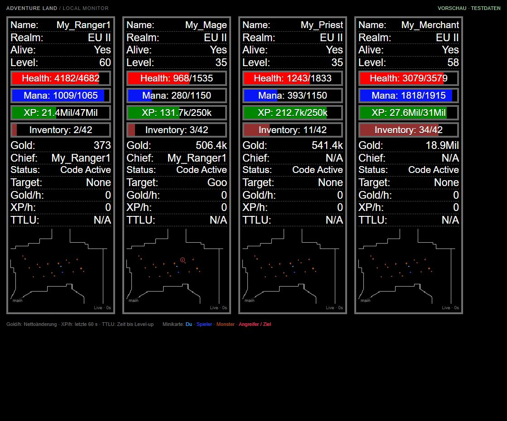

# Ergänzung für ALBot 0.7.0-full

Für KI-Arbeit am aktuellen Super-Bot zuerst [AUTONOMIE-0.7.0](docs/AUTONOMIE-0.7.0.md) lesen: alle neuen internen Module, Auftrags-/Quoten-/Definitionsbindung, neue optionalen Profilfelder und ihre Grenzen. Der Headless-Client-Vertrag unten und die öffentlichen ALBot-APIs bleiben unverändert. Keine Node-/Hostimports in Botcode, gleiche klassische JS-Datei für beide Umgebungen. Autostart true, Browser performance_trick. Persistente Wertjournale nicht löschen. Neue Abläufe noch nicht gemeinsam live bestätigt.

# Ergänzung für Super-Bot 0.6.0-full

Die vorhandene API bleibt kompatibel. Für fortlaufende Vollbetriebs-Testlogs die mitgelieferte `tools/client-test-report.js` in `src/test-report.js` des Clients übernehmen; die persönliche Desktopinstallation ist bereits angepasst. `parent.headless.writeTestReport(content)` akzeptiert zusätzlich `continuousLog:true`, gültigen character/started und sequenzierte events im bekannten Reportformat. Der Client schreibt dann Desktop/ALBot-Testlogs/test-CHARAKTER-UTCSTART-partNNN.jsonl und behält den bisherigen kompakten Bericht. Botcode schreibt keine eigenen Hostdateien. Browser nutzt `ALBot.chooseLogDirectory()` nach Benutzerklick oder `ALBot.exportTestReport()` als Download. Weitere Bot-APIs und Logdetails: [docs/VOLLBETRIEB.md](docs/VOLLBETRIEB.md). Kein Updater.

# Ergänzung: aktueller Super-Bot P3/P4

Der folgende Headless-Client-Vertrag bleibt unverändert maßgeblich. Der neue Bot 0.5.0-p3p4 verwendet keine neue Host-API. Für KI-Arbeit am Bot zusätzlich [P3/P4-Regel-/Produktionsvertrag](docs/P3-P4.md), [RUNTIME-VERTRAG](docs/RUNTIME-VERTRAG.md) und [WORKSHOP-CONTRACT](docs/WORKSHOP-CONTRACT.md) lesen. Eine klassische Datei für Browser/Headless, Autostart true, Browser immer performance_trick. Explizite Item-Regeln gewinnen vor automatischer Zielplanung. Testbericht weiter test-ausgeführtertest.json; gemeinsamer Ablauf [P3-P4-LIVE](docs/P3-P4-LIVE.md).

# Adventure Land Headless 1.2.2 — Benutzerhandbuch und Bot-Vertrag für KIs

Stand: 6. Oktober 2026. Implementierung: dieses Projekt, API-Version 1.
Referenz-Spielcache für die Tests: 17478. Dieses Dokument beschreibt die tatsächlich
implementierte API, einschließlich ihrer Grenzen. Es ist als vollständige Übergabe
an eine andere KI gedacht. Ergänzend gibt es `docs/headless-api.d.ts` für den Editor.

## 1. In zwei Minuten verstehen

Der Client führt die offiziellen Adventure-Land-Spielquellen und CODE-Funktionen
in Node.js aus. Ein Supervisor verwaltet je einen Prozess pro Charakter. Innerhalb
eines Charakterprozesses gibt es eine Spielumgebung (`parent`) und eine
CODE-Umgebung (`globalThis`). jsdom stellt die nötige Browserstruktur bereit;
die Grafik ist abgeschaltet. Es läuft kein Chromium und kein Electron.

Ein Bot ist eine normale JavaScript-Datei, zum Beispiel `CODE/main.js`. Sie wird
nach dem Spielstart als **klassisches CODE-Skript** ausgeführt. `character`,
`parent`, `attack`, `smart_move`, `loot`, `use_skill`, `set`, `get` und die übrigen
geladenen Spiel-Funktionen stehen wie im CODE-Editor zur Verfügung. Die Datei ist
kein Node-Modul: kein `import`, `export`, `require`, `process` oder `Buffer` im Bot
voraussetzen. Asynchrone Initialisierung in eine `async`-Funktion verpacken.

Es gibt zwei Erweiterungsobjekte:

| Objekt | Zweck | Im offiziellen Browser vorhanden? |
|---|---|---|
| `parent.caracAL` | Kompatibilität mit den zentralen CaracAL-Erweiterungen | Nein |
| `parent.headless` | Eigene API dieses Clients, besonders lokale Nachrichten ohne CM | Nein |

Die Schreibweise **`caracAL`** ist wichtig. Es gibt kein `caracal.api`,
`parent.caracal`, `caracAL.api` oder globales `headless` als zugesicherte API.
Immer über `parent` zugreifen und bei browserfähigen Bots vorher prüfen.

## 2. Installation, Anmeldung und Start

Voraussetzung: Node.js **mindestens 22.9**, beispielsweise Node.js 24, mit npm.
Der Quellcode verwendet portable Node-APIs für Windows und Linux.

Windows PowerShell, im Projektverzeichnis:

```powershell
node --version
npm.cmd ci
Copy-Item .env.example .env
Copy-Item config.example.json config.json
```

Linux:

```bash
node --version
npm ci
cp .env.example .env
cp config.example.json config.json
chmod 600 .env
```

Die beiden Kopierbefehle nur bei der Ersteinrichtung ausführen, damit vorhandene
Zugangsdaten und Einstellungen erhalten bleiben. In `.env` entweder eine gültige
Sitzung `AL_SESSION="BENUTZER-ID-AUTH-TOKEN"` oder `AL_EMAIL` und `AL_PASSWORD`
eintragen. Ein gesetztes `AL_SESSION` hat Vorrang. Im angemeldeten Browser liefert
`show_json(parent.user_id + "-" + parent.user_auth)` den Sitzungswert. Er ist ein
Zugangsschlüssel; eine KI benötigt ihn nicht zum Programmieren eines Bots.

```powershell
npm.cmd run account
npm.cmd run check
npm.cmd start
```

Unter Linux jeweils `npm` verwenden. `account` meldet sich an und zeigt die
Charakter-/Servernamen. `check` prüft Konfiguration und lokale Skript-Syntax ohne
Login. `start` meldet die aktivierten Charaktere an. `Strg+C` beendet den Client.
Unter Windows kann nach der Einrichtung auch `start.cmd` verwendet werden.

### Alle CLI-Befehle

| Befehl | Wirkung |
|---|---|
| `npm start` | Konfigurierte aktive Charaktere starten |
| `npm run check` | Konfiguration und alle konfigurierten Skripte/Bibliotheken syntaktisch prüfen; auch deaktivierte Charaktere |
| `npm run account` | Angemeldeten Account auf Charaktere und Server abfragen |
| `npm run update-game` | Öffentliche Spielquellen neu laden und Cache aktualisieren |
| `npm run smoke` | Echte Spielquellen mit Fake-Socket und Test-CODE ausführen; kein echter Login |
| `npm test` | Unit- und Routingtests ausführen |
| `node src/cli.js --help` | Befehlsübersicht |

Der erste Start/Smoke-Test braucht Internet für fehlende öffentliche Spielquellen.
`check` und die Unit-Tests benötigen keine Serververbindung. Vor einem Spielupdate
alle Clientprozesse beenden. Danach Smoke-Test ausführen.

## 3. Konfiguration und Dateien

```json
{
  "updateMs": 100,
  "dashboard": { "enabled": false, "port": 9240, "updateMs": 1000, "minimap": true },
  "libraries": { "Helpers": "./CODE/examples/library.js" },
  "reconnect": { "initialMs": 3000, "maxMs": 60000 },
  "characters": [
    {
      "name": "My_Merchant", "region": "EU", "server": "II",
      "script": "./CODE/examples/team.js", "enabled": true
    },
    {
      "name": "My_Ranger1", "region": "EU", "server": "II",
      "script": "./CODE/examples/team.js", "enabled": true
    },
    {
      "name": "My_Ranger2", "region": "EU", "server": "II",
      "script": "./CODE/examples/team.js", "enabled": false
    }
  ]
}
```

Jeder Charakter braucht **ein eigenes Objekt** in `characters`. Mehrere `name`-
Schlüssel im selben Objekt erzeugen keine weiteren Charaktere; JSON.parse behält
den letzten Wert. Namen müssen eindeutig sein und zum angemeldeten Account passen.
Mindestens ein Charakter muss beim Start aktiviert sein.

| Feld | Vertrag |
|---|---|
| `characters[].name` | Exakter Charaktername; erforderlich |
| `region`, `server` | Exakte Werte aus `account`, zum Beispiel `EU` und `II`; erforderlich |
| `script` | Lokaler Dateipfad; erforderlich; relative Pfade gelten ab Projektverzeichnis |
| `enabled` | Boolean, Standard aktiv; `false` lässt den Charakter zunächst ausgeschaltet |
| `libraries` | Objekt aus CODE-Slotname oder numerischem Slot als String → lokale Datei |
| `characters[].libraries` | Ergänzt/überschreibt globale Zuordnungen für diesen Charakter |
| `updateMs` | Globale Ganzzahl 16–250, Standard 100; Mindestabstand für bestimmte interne Draw-/lokale-CM-Timer |
| `reconnect.initialMs` | Standard 3000, mindestens 1000 |
| `reconnect.maxMs` | Standard 60000; mindestens initialMs, höchstens 3600000 |
| `dashboard` | Optionales Konfigurationsobjekt für das lokale Dashboard, standardmäßig deaktiviert; Details unten |

Die CLI wechselt vor dem Lesen in das Projektverzeichnis. Beim Bearbeiten auf
Linux Groß-/Kleinschreibung in Dateinamen beachten. In JSON funktionieren
Vorwärtsschrägstriche auf beiden Betriebssystemen.

`config.json` ist die Startkonfiguration. `deploy`, `shutdown`, `start_character`
und `change_server` ändern nur den laufenden Supervisor. Sie schreiben die Datei
nicht zurück. Nach einem vollständigen Neustart gilt wieder `config.json`.

Dateien:

- `CODE/`: eigene Bots und optionale Zusatzskripte.
- `.cache/game/`: heruntergeladene Spielquellen, einschließlich Spiel-API.
- `.cache/localStorage.json`: gemeinsamer persistierter lokaler Speicher.
- `src/`: Client, Supervisor und Erweiterungen; normalerweise nicht aus Bots importieren.
- `docs/headless-api.d.ts`: ergänzende Typinformationen für die Client-Erweiterungen.
- `CODE/examples/team.js`: ausführbares Beispiel für Browser-/Headless-Koordination.
- `CODE/examples/library.js`: einfache Bibliothek mit `botLog(message)`.
- `dashboard/`: lokale HTML-/CSS-/JS-Dateien der Statusanzeige, ohne CDN oder Buildschritt.

### 3a. CaracAL-artiges lokales Dashboard

Das Dashboard zeigt nebeneinander Charakterkarten nach dem CaracAL-Vorbild:
schwarzer Hintergrund, graue Rahmen, rote HP-, blaue MP-, grüne XP- und braune
Inventarbalken sowie eine Minikarte. Es ist **standardmäßig ausgeschaltet**.
Es benötigt keine zusätzlichen npm-Pakete und ist eine reine Statusanzeige.
Start/Stopp, Skriptbearbeitung und Itemregeln erfolgen weiterhin über den Client,
die Bot-API bzw. die separate Bot-Werkstatt.



#### Einschalten und aufrufen

Diesen Block auf oberster Ebene der vorhandenen `config.json` ergänzen oder
`enabled` im bereits vorhandenen Block ändern. Die anderen Felder, insbesondere
`characters`, beibehalten. Auf Kommas zwischen den JSON-Feldern achten.

```json
"dashboard": {
  "enabled": true,
  "port": 9240,
  "updateMs": 1000,
  "minimap": true
}
```

Den laufenden Client mit **Strg+C vollständig beenden**, danach `npm.cmd start`
unter Windows bzw. `npm start` unter Linux. Sobald die Konsole
`Dashboard: http://127.0.0.1:9240 (nur lokal)` meldet, diese Adresse im Browser
öffnen: **http://127.0.0.1:9240/**. Die Startmeldung erscheint nach der Account- und
Spielcache-Prüfung. Zum Ausschalten `enabled: false` setzen und erneut starten.
Auch ein komplett fehlender `dashboard`-Block bedeutet ausgeschaltet.

| Feld | Standard | Bedeutung |
|---|---|---|
| `enabled` | `false` | Startet den lokalen HTTP-Server nur bei Boolean `true` |
| `port` | `9240` | Ganzzahl 1024–65535, damit auch Linux keinen privilegierten Port benötigt |
| `updateMs` | `1000` | Telemetrieintervall je Charakter, Ganzzahl 500–10000 ms; unabhängig vom Spiel-`updateMs` |
| `minimap` | `true` | Minikarten bei aktivem Dashboard; `false` spart deren Erfassung/Übertragung |

Beispiel für geringere Dashboard-Last: `updateMs: 2000`, `minimap: false`.
Konfigurationsänderungen benötigen immer einen vollständigen Neustart. Diese
Felder gelten global; Einstellungen unter einzelnen Charakteren werden nicht
als eigener Dashboard-Server verwendet.

#### Angezeigte Daten

| Feld | Bedeutung |
|---|---|
| Name / Realm | Charaktername und konfigurierter Spielserver |
| Alive | `Yes` bei lebendem, `No` bei gestorbenem Charakter; `—` ohne aktuelle Verbindung |
| Level | Aktuelles Level |
| Health / Mana | Aktuelle/maximale HP bzw. MP |
| XP | Erfahrung im aktuellen Level / benötigte Erfahrung für das Level |
| Inventory | Belegte Inventarplätze / verfügbare Plätze; Stackmenge ist nicht Platzanzahl |
| Gold | Aktueller Goldbestand |
| Chief | Party-Leader, sonst `N/A` |
| Status | Clientstatus bzw. mit `set_message` gesetzter Status; alternativ Connecting, Waiting oder Stopped |
| Target | Sichtbares Ziel, etwa Monstername; `None`, wenn keines auflösbar ist |
| Gold/h | Auf eine Stunde hochgerechnete **Nettoänderung des Goldbestands**, einschließlich Einkäufen, Verkäufen, Bank-/Charaktertransfers |
| XP/h | Hochgerechnete XP-Änderung im Beobachtungsfenster; Level-ups werden berücksichtigt, XP-Verlust kann negativ sein |
| TTLU | Geschätzte Restzeit bis zum Level-up; `N/A`, wenn die XP-Rate nicht positiv oder eine Grundlage unbekannt ist |

Raten verwenden die verfügbaren Messpunkte der letzten 60 Sekunden und sind
anfangs 0. Sie sind keine garantierten Farming-Erträge. Bei Neustart oder wenn
nach einer Phase ohne sichtbare Dashboard-Tabs die Erfassung neu beginnt, beginnt
auch das Messfenster neu. Sehr kurze Fenster können stark schwankende Werte zeigen.
Eine mehrfache Leveländerung ohne bekannte XP-Grenzen setzt die XP-Messung zurück.

Die Minikarte zeigt einen Ausschnitt von ungefähr **600 × 450 Spieleinheiten** um
den eigenen Charakter. Graue Linien sind Kollisionsgrenzen, keine Texturen.
Hellblau markiert den eigenen Charakter, Blau andere Spieler, Braun Monster,
Rot angreifende Monster und ein Ring das aktuelle Ziel. NPCs, tote und außerhalb
des Ausschnitts liegende Entitäten werden ausgelassen. Kartendaten stammen aus
der Sicht des jeweiligen Charakters; das ist keine vollständige Welt-/Spawnkarte.

#### Ressourcen und Verbindung

Bei `enabled: false` wird kein HTTP-Server erzeugt und kein Telemetrietimer
gestartet. Ist das Dashboard aktiv, aber kein sichtbarer Browser-Tab verbunden,
bleibt nur der lokale Webserver bereit. Die Charaktere senden dann keine
Dashboard-Messwerte und erzeugen keine Minikartendaten.

Ein sichtbarer Tab abonniert Server-Sent Events. Beim Wechsel in den Hintergrund
oder beim Schließen trennt er sein Abonnement. Sobald kein Tab mehr abonniert
ist, stoppt der Supervisor die Telemetrietimer. Mehrere sichtbare Tabs teilen
dieselben Messwerte; maximal acht gleichzeitige Abonnements sind vorgesehen.
Das Browserfenster zeichnet die Minikarte per Canvas; der Headlessprozess braucht
weiterhin keinen Grafikrenderer. Geometrie und Entitäten werden auf den lokalen
Ausschnitt sowie höchstens 3000 Linien und 500 Entitäten je Karte begrenzt.

Der Server bindet ausschließlich an **127.0.0.1**, unabhängig von zusätzlichen
unbekannten JSON-Feldern. Es ist kein LAN-/Internet-Dashboard und hat keine
Fernsteuerung oder Anmeldung. Er liefert nur die drei UI-Dateien und den
`GET /events`-Datenstrom aus, nicht `config.json`, `.env`, CODE-Dateien oder
Account-Sitzungen. Nicht ohne separate Zugriffssicherung über einen Proxy
öffentlich bereitstellen. Bei Linux ohne grafischen Desktop lässt sich der
Loopback-Port bei Bedarf über einen selbst eingerichteten SSH-Tunnel betrachten.

Bei Browser-Verbindungsverlust erscheinen ein Hinweis und veraltete Daten mit
farblicher Markierung. Der Browser versucht die Verbindung erneut. Beendete
Charakterprozesse zeigen keine alten Werte als lebenden Charakter an. Alle
konfigurierten Charaktere werden aufgeführt, auch zunächst deaktivierte.

#### Fehlersuche

- **Seite nicht erreichbar:** `enabled` prüfen, Client vollständig neu starten
  und die Konsolenadresse abwarten. Die HTML-Datei nicht per Doppelklick öffnen;
  Live-Daten benötigen den lokalen HTTP-Server.
- **Port belegt:** anderen `dashboard.port`, etwa 9242, einstellen und neu starten.
  Der Client meldet den Konflikt ausdrücklich, bevor Charakterprozesse starten.
- **Keine aktuellen Daten:** Charakterstatus/Clientkonsole prüfen. Der Datenstrom
  ersetzt keinen erfolgreichen Spiel-Login. Sichtbaren Dashboard-Tab verwenden.
- **Keine Minikarte:** `minimap` prüfen; während Login, bei fehlenden Kartendaten
  oder abgeschaltetem Charakter ist eine leere Karte normal.
- **Gold/h negativ:** Ausgaben und Transfers zählen zur Nettoänderung; das ist
  keine reine Loot-Statistik.

Es ist kein spezieller Bot-Code für das Dashboard nötig. Die vorhandenen
Gameplay-/CODE-Skripte funktionieren unverändert. Bei der KI-Übergabe genügen
weiterhin dieses Handbuch und die Bot-Dateien.

## 4. Vollständige öffentliche CaracAL-Kompatibilitäts-API

Die Referenz wurde mit dem Originalprojekt
[numbereself/caracAL, Commit 234af745](https://github.com/numbereself/caracAL/tree/234af745d59807be4da49f13430b91980d3e98c9)
abgeglichen. Dieser Client implementiert die folgenden Einträge selbst; er ist
kein vollständiger CaracAL-Fork.

### `parent.caracAL.deploy(name?, realm?, script?, gameVersion?) → Promise<true>`

Startet einen konfigurierten Charakter oder startet einen bereits laufenden neu.

- `name`: Zielname; `null`, `undefined` oder leer bedeutet eigener Charakter.
- `realm`: zum Beispiel `EUII` oder `USI`; muss zum geladenen Serververzeichnis passen.
  Ohne Wert wird **der Server des aufrufenden Charakters** übernommen.
- `script`: Pfad relativ zum `CODE`-Ordner, etwa `farmer.js` oder `roles/merchant.js`.
  **Nicht** `CODE/farmer.js` schreiben. Ohne Wert wird **das Skript des Aufrufers**
  übernommen, auch wenn das Ziel zuvor ein anderes Skript verwendete.
- `gameVersion`: weglassen, `0` oder die aktuell geladene Spielversion angeben.
  Andere Versionen werden abgelehnt; es gibt keinen getrennten Versionsloader.
- Ziel muss in `config.json` stehen. Anders als im Original werden unbekannte
  Charaktere nicht dynamisch zur Konfiguration hinzugefügt.
- Datei, Syntax und Server werden vor dem Stopp des Zielprozesses geprüft.
- Das Promise bestätigt die **Annahme des Neustartauftrags**, nicht den erfolgreichen
  Login. Bei eigenem Neustart ist nachfolgender Code nicht zuverlässig ausführbar.

```javascript
if (parent.caracAL) {
  parent.caracAL.deploy('My_Ranger2', 'EUII', 'examples/team.js')
    .catch(function (error) { game_log(error.message); });
}
```

`deploy()` ohne Parameter lädt den eigenen Charakter und dessen aktuelles Skript
neu. Nicht ungeschützt bei jedem Skriptstart aufrufen: Das erzeugt eine Neustartschleife.
Für das bloße Starten eines noch nicht laufenden Charakters mit dessen eigener
Konfiguration eignet sich `start_character(name)` besser.

### `parent.caracAL.shutdown(name?) → Promise<true>`

Stoppt das Ziel und deaktiviert dessen automatischen Neustart im laufenden
Supervisor. Ohne Name wird der eigene Charakter beendet. Die Bestätigung bedeutet
Auftrag angenommen. `on_destroy()` wird beim geordneten Schließen synchron
aufgerufen; asynchrone Arbeit darin wird nicht abgewartet. Nach vier Sekunden
kann ein nicht reagierender Zielprozess erzwungen beendet werden.

### `parent.caracAL.siblings → string[]`

Liefert eine neue, sortierte Liste der dem Supervisor als CODE-bereit gemeldeten
Charaktere, einschließlich des eigenen Namens. Prozesse im Verbindungsaufbau
fehlen. Der eigene Name ist schon während des eigenen Skriptstarts enthalten.
Aktualisierung erfolgt asynchron über IPC; die Liste ist keine Reservierung oder
Garantie, dass ein Charakter beim nächsten Aufruf noch erreichbar ist.

### `parent.caracAL.load_scripts(paths) → Promise<void>`

Führt die angegebenen Dateien nacheinander im **bestehenden CODE-Kontext** aus:

```javascript
(async function () {
  if (parent.caracAL) {
    await parent.caracAL.load_scripts(['examples/library.js']);
  } else {
    load_code('Helpers');
  }
  botLog('Bibliothek geladen');
})().catch(function (error) { game_log(error.message); });
```

Die Pfade sind relativ zu `CODE`. Absolute Pfade, URLs und Pfade außerhalb von
CODE werden abgelehnt, auch nach Auflösen von Symlinks. Die Funktion lädt jedes
Mal neu, ohne Cache oder Deduplizierung. Ein Fehler stoppt die restliche Liste;
bereits ausgeführte Dateien werden nicht zurückgerollt. Bereits erzeugte Timer
laufen weiter. Wiederholtes Laden von `let`-/`const`-Deklarationen auf oberster
Ebene kann einen Syntaxfehler verursachen. Bibliotheken deshalb bewusst modular
strukturieren, beispielsweise mit IIFE und explizit veröffentlichten Funktionen.

### `parent.caracAL.map_enabled() → boolean`

Seit Version 1.2 `true`, wenn `dashboard.enabled` und `dashboard.minimap` beide
aktiviert sind, sonst `false`. Der Wert beschreibt die Konfiguration, nicht ob
gerade jemand das Dashboard betrachtet oder eine Spielkarte geladen ist. Die
eigentlichen Kartendaten existieren auch ohne Dashboard weiterhin.

### `parent.caracAL.runner → Window`

Der eigene CODE-Kontext, bereits vor Ausführung der Hauptdatei gesetzt. Kein
Zugriff auf fremde Charakterprozesse, kein gemeinsamer JavaScript-Heap. Für normale
Bots ist `globalThis` ausreichend; `runner` ist ein Kompatibilitätseintrag.

### `parent.caracAL.log`

Leichtgewichtiger Logger mit einer **Teilmenge** der Pino-Aufrufe:

| Eintrag | Wirkung |
|---|---|
| `trace(...args)` | Level 10 |
| `debug(...args)` | Level 20 |
| `info(...args)` | Level 30 |
| `warn(...args)` | Level 40 |
| `error(...args)` | Level 50 |
| `fatal(...args)` | Level 60; beendet den Prozess nicht |
| `child(bindings)` | Neuer Logger mit zusätzlichen festen Feldern; übernimmt aktuellen Schwellwert |
| `isLevelEnabled(level)` | Boolean für den angegebenen Level |
| `level` | Les-/schreibbarer Schwellwert: `trace`, `debug`, `info`, `warn`, `error`, `fatal`, `silent` |

Standard-Level ist `info`. Ein erstes Objekt liefert strukturierte Felder;
folgende Argumente werden als formatierte Nachricht verarbeitet. Error-Objekte
werden unter `err` ausgegeben. Kreisreferenzen werden markiert. Beispiel:

```javascript
if (parent.caracAL) {
  var logger = parent.caracAL.log.child({ role: 'merchant' });
  logger.info({ item: 'hpot1', quantity: 100 }, 'Versorgung geplant');
  logger.warn('Empfaenger %s nicht erreichbar', 'My_Ranger1');
}
```

Ausgabe erfolgt auf stdout: Charakterpräfix plus JSON-Nachricht mit `level`,
`time` in Millisekunden, `cname` und `msg`. Deshalb ist der gesamte Konsolenstrom
kein reines JSONL. Keine Pino-Transports, Streams, Serializers, Logrotation,
Dateisinks oder vollständige Pino-Konfiguration. Änderungen am Level eines
Elternloggers ändern vorhandene Child-Logger nicht nachträglich.

## 5. Vollständige eigene `parent.headless`-API

Alle Funktionen arbeiten innerhalb **eines gestarteten Supervisors auf einem
Rechner**. Zwei getrennte `npm start`-Instanzen teilen weder Nachrichten noch
live synchronisierten Speicher. Dasselbe Datenverzeichnis sollte nicht gleichzeitig
von zwei Supervisors beschrieben werden.

### Eigenschaften

| Eintrag | Wert in Version 1.2 |
|---|---|
| `version` | `"1.2.1"`, Clientversion |
| `apiVersion` | `1`, Version dieses API-Vertrags |
| `capabilities.localMessages` | `true` |
| `capabilities.localCM` | `true` |
| `capabilities.sharedStorage` | `true` |
| `capabilities.caracal` | `true`, beschriebene Kompatibilitätsschicht |
| `capabilities.graphics` | `false` |
| `capabilities.dashboard` | Boolean entsprechend `dashboard.enabled` |
| `capabilities.minimap` | Boolean entsprechend `dashboard.enabled && dashboard.minimap` |

Objekt und Capabilities sind eingefroren. Fähigkeitsprüfung:
`if (parent.headless && parent.headless.capabilities.localMessages) { ... }`.

### `send(to, topic, data) → Promise<{queued: string[]}>`

Sendet eine Nachricht an einen Namen oder eine nichtleere Namensliste. Doppelte
Namen werden entfernt. `topic` ist ein String von 1–128 Zeichen. `data` wird als
JSON kopiert und darf serialisiert höchstens **65.536 UTF-8-Bytes** enthalten.
`null`, Strings, Zahlen, Booleans, Arrays und einfache Objekte eignen sich.
Kein `undefined` als Gesamtnachricht, keine Zyklen, BigInt, Funktionen oder
Spielobjekte übertragen. JSON entfernt/konvertiert nicht darstellbare Einzelwerte
wie üblich; beispielsweise wird `NaN` zu `null`. Nur explizite Nutzdaten senden.

```javascript
await parent.headless.send('My_Merchant', 'supply-request', {
  item: 'hpot1', quantity: 80, time: Date.now()
});
```

Der Aufruf nutzt Betriebssystem-IPC, **keine Spiel-CM**, keinen HTTP-Server und keine
Festplatte. Die Charaktere dürfen auf unterschiedlichen Spielservern laufen.
Das ermöglicht Nachrichten, aber keine serverübergreifenden Itemtransfers.

Alle Ziele müssen beim Routing CODE-bereit sein. Andernfalls wird der Aufruf
abgelehnt, bevor an andere Ziele gesendet wird. Es gibt keinen CM-Fallback dieser
Funktion. Bei Rennen mit einem Disconnect kann eine bereits eingereihte Nachricht
trotzdem verloren gehen. `queued` bedeutet eingereiht, **nicht vom Empfänger
verarbeitet**. Keine persistente Warteschlange, Wiederholung oder automatische
Antwort. Wichtige Aufträge brauchen eigene IDs, Bestätigungen und Deduplizierung.

### `broadcast(topic, data) → Promise<{queued: string[]}>`

Sendet an die aktuell CODE-bereiten anderen Charaktere dieses Supervisors. Der
Absender wird ausgelassen. Ohne Ziele wird `{queued: []}` zurückgegeben. Es gelten
dieselben Datenlimits und Zustellgrenzen wie für `send`.

### `onMessage(handler) → unsubscribe`

Registriert einen lokalen Listener. Er erhält `{from, topic, data}`. `from` wird
vom Supervisor aus dem tatsächlichen Absenderprozess gesetzt. Der Handler darf
ein Promise zurückgeben. Handler werden nicht serialisiert: Die Verarbeitung
mehrerer Nachrichten kann überlappen. Fehler werden protokolliert und verhindern
nicht die Ausführung anderer Listener. Falls nötig, eine eigene Arbeitswarteschlange
führen. Listener früh im Skript registrieren; es gibt kein Replay früherer Nachrichten.

```javascript
var off = parent.headless.onMessage(function (event) {
  if (event.topic !== 'supply-request') return;
  game_log(event.from + ': ' + JSON.stringify(event.data));
});
// Spaeter: off();  // entfernt den Listener; wiederholter Aufruf ist unschaedlich
```

`unsubscribe()` gibt beim erstmaligen Entfernen `true`, danach `false` zurück.
Beim Schließen des CODE-Kontexts werden die Listener verworfen.

## 6. Angepasste Browser-APIs und gemeinsame Daten

Diese Namen stammen aus Adventure Land und sind keine zusätzlichen Methoden auf
`parent.headless`. Der Client bindet sie an lokale Prozesse bzw. Speicher an.

| Funktion | Verhalten im Client |
|---|---|
| `start_character(name, slot?)` | Startet einen eingetragenen Charakter; Promise löst mit Namen auf, sobald CODE als bereit gemeldet ist. Bereits bereit: kein Neustart. Optionaler Slot muss in den lokalen `libraries` des Ziels stehen. Ohne Slot gilt dessen aktuell konfigurierte Datei. |
| `stop_character(name)` | Stoppt/deaktiviert Ziel. Gibt wie die Browser-Funktion kein bestätigendes Promise zurück; Fehler werden geloggt. |
| `command_character(name, code)` | Reiht einen JavaScript-String zur Ausführung im Ziel-CODE ein. Kein Ergebnis/RPC, keine Rückgabe des dortigen Ausdrucks. Ziel muss bereit sein. |
| `get_active_characters()` | Objekt mit Namen → `self`, `loading` oder `code`; momentane lokale Sicht |
| `change_server(region, server)` | In diesem Client Promise für angenommenen Auftrag; startet den eigenen Prozess neu, behält Skript. Keine Fortsetzungsgarantie für eigenen CODE. |
| `load_code(slot)` | Bei lokaler `libraries`-Zuordnung: synchron im aktuellen CODE ausführen. Ohne Zuordnung wird der originale Cloud-Pfad benutzt; nicht live getestet. |
| `require_code(slot)` | Originale Spiel-Implementierung; greift ebenfalls auf die lokale Bibliothekszuordnung zu. Kein Node-`require`. |
| `set(key, value)` | JSON-Wert im gemeinsamen lokalen Speicher; Rückgabe Boolean |
| `get(key)` | JSON-Wert oder `null`; lokale replizierte Sicht |
| `pset(key, value)`, `pget(key)` | Originale persistente String-Speicherfunktionen |
| `localStorage` | Synchrones lokales API mit asynchroner Übertragung zwischen Prozessen, siehe unten |
| `send_cm(to, data)` | Lokale Empfänger über IPC, übrige über den originalen Spielserver-CM-Pfad |
| `game_log`, `console.log/info/warn/error`, `show_json` | Konsolenausgabe statt sichtbarer GUI; console.debug ist in der Browseremulation stumm. Für Debuglogs den eigenen Logger nutzen. |
| `fetch(url, options)` | Node-fetch-Funktion in der CODE-Umgebung; kein Browser-Cookie-Jar für beliebige Requests voraussetzen |

### CM-Kompatibilität

`send_cm(nameOderListe, data)` liefert hier ein Promise mit `{locals, receivers}`.
Die lokale Empfängerliste wird vom Supervisor entschieden. Andere Empfänger werden
an `send_server_cm` übergeben; dafür gelten die echten Spielkosten und Beschränkungen.
Auch dieses `send_cm` verwendet das JSON-Datenlimit von 65.536 Bytes des Clients;
für den Serverpfad können engere Spielgrenzen gelten.

Lokale Nachrichten kommen über den normalen Handler:

```javascript
character.on('cm', function (event) {
  // event.name: Absender, event.message: Nutzdaten
  // event.caracAL === true nur bei lokal durch diesen Client gerouteten CMs
});
```

Bei einem Fehler des Serverpfads kann der lokale Teil bereits zugestellt sein.
Der Fehler enthält `locals`, `receivers` und `cause`. `send_server_cm` direkt
umgeht die lokale Optimierung. Für strikt lokale Koordination `headless.send`
verwenden; dadurch ist kein CM-Handler nötig.

### Speichervertrag

`localStorage.getItem`, `setItem`, `removeItem`, `clear`, `key(index)` und `length`
sowie Eigenschaftszugriff werden unterstützt. Werte sind Strings. `set/get`
legen JSON unter intern mit `cstore_` präfixierten Schlüsseln ab. Nicht gleichzeitig
mit `pset` auf dieselben rohen Schlüssel schreiben.

Ein Schreibzugriff ist im eigenen Prozess sofort sichtbar, bei anderen nach der
IPC-Übertragung. Das ist **kein atomarer gemeinsamer Heap**. Gleichzeitige
Read-Modify-Write-Operationen können Änderungen überschreiben. Keine Locks oder
Inventarreservierungen mit `get(...) + set(...)` vortäuschen. Pro Schlüssel einen
verantwortlichen Schreiber wählen, zum Beispiel `team:state:My_Ranger1`.

Der Supervisor persistiert gebündelt nach ungefähr einer Sekunde und beim
geordneten Beenden. `activity` und Schlüssel mit Präfix `cm_` werden nicht dauerhaft
gespeichert. Ein Absturz kann letzte Änderungen verlieren. Persistierter Zustand
überlebt Bot-Neustarts: Zeitstempel/TTL verwenden und alte Aufträge nicht ungeprüft
erneut ausführen. `localStorage.clear()` betrifft alle Charaktere dieser Instanz.

Browser- und Headless-Speicher sind getrennt. Auch _sessionStorage/sessionStorage
ist kein zugesicherter prozessübergreifender Kommunikationsweg dieses Clients.

## 7. Ein Bot für Browser UND Headless

Die Datei `CODE/examples/team.js` läuft unverändert in beiden Umgebungen. Vorher
die Liste `TEAM` und `MERCHANT` im Beispiel anpassen. Das Beispiel veröffentlicht
kleine Zustandsdaten, fragt Versorgung an und protokolliert Merchant-Aufträge.
Es kauft/verkauft nichts, bewegt sich nicht und greift nicht an.

Die zentrale Transportentscheidung:

```javascript
function sendTeam(to, topic, data) {
  if (parent.headless) return parent.headless.send(to, topic, data);
  return send_cm(to, { protocol: 'my-team-v1', topic: topic, data: data });
}
```

Headless den lokalen Listener registrieren, im Browser `character.on('cm', ...)`
verwenden und beide auf dieselbe interne Handlerfunktion abbilden. Im Browser
Absender und Protokoll prüfen. Ein eigener Headless-Client und ein Browser-Tab
gehören nicht zum selben IPC-Bus: Für gemischte Teams bewusst `send_cm` verwenden.
Der Beispieladapter fällt im Headlessbetrieb bei einem fehlenden lokalen Ziel
nicht automatisch auf CM zurück.

Skripte im Browser visuell prüfen, dann dieselbe Datei lokal speichern. Vor dem
Headlessstart denselben Charakter im Browser ausloggen. Nach Änderungen `Strg+C`
und neu starten oder gezielt von einem anderen Charakter `deploy` ausführen.
Es gibt keinen Dateiwächter und keinen automatischen Cloud-CODE-Upload.

### Ein ressourcenschonender Bot-Takt

Keine überlappenden asynchronen `setInterval`-Schleifen für Inventaraktionen.
Eine selbst planende Schleife verhindert, dass ein langsamer Aufruf eine zweite
Aktion auf demselben Item-Slot startet:

```javascript
(function () {
  var stopped = false, timer;
  async function tick() {
    try {
      if (!character.rip) {
        // Hier genau den naechsten Schritt des Zustandsautomaten ausfuehren.
        // Beispiel: await attack(target), aber erst nach can_attack(target).
      }
    } catch (error) {
      game_log(String(error.message || error.reason || error));
    } finally {
      if (!stopped) timer = setTimeout(tick, 250);
    }
  }
  var previousDestroy = globalThis.on_destroy;
  globalThis.on_destroy = function () {
    stopped = true;
    clearTimeout(timer);
    if (typeof previousDestroy === 'function') previousDestroy();
  };
  tick();
})();
```

Cooldowns, Reichweiten, Tod, Mapwechsel und laufende `smart_move`-Vorgänge separat
prüfen. Ein eigener Timeout kann eine hängende Operation erkennen, bricht aber
einen bereits beim Spielserver angekommenen Kauf/Verkauf nicht automatisch ab.
Nach unklarem Ausgang zuerst aktuellen Zustand prüfen, bevor dieselbe Aktion
wiederholt wird.

## 8. Farmer, Merchant und genaue Itemregeln

Der Client stellt Laufzeit und Kommunikation bereit. Itementscheidungen gehören
in den Bot bzw. die Bot-Werkstatt. Es gibt **keine** eingebaute Funktion wie
`headless.autoMerchant`, `caracAL.transferInventory` oder `headless.itemRules`.
Eine KI darf solche Funktionen nicht erfinden.

Ein geeignetes Regelschema enthält pro Item-ID beispielsweise:

```javascript
var itemRules = {
  hpot1: {
    farmer: { action: 'keep', minimum: 100, requestBelow: 20 },
    merchant: { action: 'supply', stockTarget: 1000, buyBudget: 100000 }
  },
  coat: {
    farmer: { action: 'send', recipient: 'My_Merchant', maxLevel: 0 },
    merchant: { action: 'keep', maxLevel: 0 },
    protectLocked: true,
    allowSpecial: false
  }
};
```

Dies ist **Bot-Konfiguration**, die der Bot selbst auswerten muss. Für ein
umfassendes Framework mindestens diese Kriterien und Entscheidungen modellieren:

- Exakte Item-ID aus `G.items`, Levelbereich, Stackmenge, Eigenschaft `p`,
  `stat_type`, Titel, gesperrter Zustand `l`, Upgrade-/Compound-Fähigkeit.
- Separate Farmer-/Merchant-Aktion: behalten, versorgen, senden, verkaufen,
  Bank, ausrüsten, im Stand anbieten, upgraden oder compounden.
- Mindestbestand pro Rolle/Charakter, Kaufbudget, Preisuntergrenzen,
  Ziellevel, maximaler Scrollgrad, Opfergabe, Bankpack und Handelsplatz.
- Explizite Regelpriorität und Konfliktauflösung. Unbekannte Items standardmäßig
  behalten. Gesperrte und besondere Items nur mit bewusster Freigabe verarbeiten.

Die tatsächlichen Spielaufrufe sind zum Beispiel:

| Spiel-Funktion | Wofür der Bot sie verwendet |
|---|---|
| `buy(itemId, quantity)` | NPC-Einkauf |
| `sell(inventoryIndex, quantity)` | Verkauf aus aktuellem Inventarslot |
| `send_item(receiver, inventoryIndex, quantity)` | Übergabe an erreichbaren Charakter |
| `send_gold(receiver, amount)` | Goldübergabe |
| `bank_store(inventoryIndex, pack?, packIndex?)` | Einlagern; Bankbedingungen beachten |
| `bank_retrieve(pack, packIndex, inventoryIndex?)` | Auslagern |
| `equip(inventoryIndex, slot?)` | Ausrüstung wechseln |
| `trade(inventoryIndex, tradeSlot, price, quantity)` | Verkaufsangebot im Merchant-Stand |
| `wishlist(tradeSlot, itemId, price, level, quantity)` | Kaufangebot |
| `upgrade(itemIndex, scrollIndex, offeringIndex?, onlyCalculate?)` | Upgrade versuchen/berechnen |
| `compound(item0, item1, item2, scrollIndex, offeringIndex?, onlyCalculate?)` | Compound versuchen/berechnen |

Diese Signaturen wurden im Cache 17478 geprüft. Die Client-Erweiterung verändert
die Spielregeln nicht. NPC-Nähe, Karte, Reichweite, Gold, Standstatus, Materialien
und Serverantworten weiterhin prüfen. Lokale Nachrichten transportieren nur
Absichten und Zustände, niemals Items.

Inventarindizes ändern sich. Deshalb unmittelbar vor jeder Aktion Slotinhalt,
Level, Menge und Schutzmerkmale erneut prüfen. Inventaraktionen pro Charakter
serialisieren; nicht gleichzeitig sortieren, verkaufen und senden. Nach Abschluss
den neuen Inventarzustand berücksichtigen. Compound benötigt drei passende
Items und muss besondere Eigenschaften bewusst behandeln.

Für Koordination ohne CM empfiehlt sich:

1. Jeder Farmer schreibt höchstens alle wenigen Sekunden eine kleine Zusammenfassung
   unter seinem eigenen Speicherschlüssel, inklusive Zeitstempel.
2. Bedarf wird über `headless.send` an den Merchant geschickt; der Merchant führt
   eine eigene Auftragswarteschlange.
3. Der Merchant vergibt eine eindeutige Auftrags-ID und bestätigt Empfang/Ergebnis.
4. Vor Kauf und Übergabe prüft er aktuelle Bestände, Budget und Erreichbarkeit.
5. Alte IDs oder abgelaufene Zustände werden nicht erneut blind ausgeführt.

`siblings` liefert Namen, keine fremden Live-`character`-Objekte. Für fremde HP,
Positionen und Inventare gezielt eigene Zustandsnachrichten oder `set/get` nutzen.

## 9. Ressourcen, Größenlimit und Kompatibilitätsgrenzen

`updateMs` reduziert bestimmte interne Timer, verändert aber keine selbst gesetzten
Bot-Timer. Häufigkeit an die Aufgabe anpassen: schnelle Kampfentscheidungen nach
Cooldown, langsame Vorratsplanung beispielsweise alle 2–10 Sekunden. Kein komplettes
`character` oder `G` regelmäßig serialisieren. Logging drosseln. Die neuen APIs
fügen keine zusätzlichen npm-Pakete hinzu. Der optionale Dashboard-Webserver
bleibt standardmäßig aus; Telemetrie läuft nur mit sichtbaren Abonnenten.

Der erweiterte Smoke-Test unter Windows/Node 24 lag bei ungefähr 200 MiB RSS für
einen Testprozess mit Spiel- und Runner-Umgebung. Kein Live-Benchmark und keine
Obergrenze. Mehrere Charakterprozesse benötigen entsprechend zusätzlichen Speicher.

Headless begrenzt die lokale Skriptdateigröße nicht künstlich. Für dieselbe Datei
im Browser muss sie zusätzlich in dessen CODE-Limit passen. Dieses Projekt plant
mit **weniger als 1 MiB (= 1.048.576 UTF-8-Bytes)** pro fertiger CODE-Datei; die
aktuell vom Spiel akzeptierte Größe abschließend im CODE-Editor prüfen. Browser-
Zeichenlänge und UTF-8-Dateigröße sind nicht dasselbe. Ein kleiner Sicherheitspuffer
und nur benötigte Itemregeln helfen. `load_scripts` hebt das Cloud-Limit nicht auf.

Dateigröße im Projektterminal messen:

```bash
node --input-type=module -e "import {readFileSync} from 'node:fs'; console.log(readFileSync('CODE/main.js').length)"
```

Für umfangreiche Entwicklung kann extern gebündelt/minifiziert werden. Ausgeliefert
wird klassisches JavaScript; der Client enthält keinen TypeScript-Compiler oder
Bundler. Die `.d.ts`-Datei liefert ausschließlich Hinweise im Editor.

Weitere Grenzen: keine echte DOM-Oberfläche, Canvas-/Audio-Funktionen, Browser-
Navigation oder vollständige PIXI-Implementierung in der Spielumgebung. Das lokale
Dashboard ist eine davon getrennte Statusseite. `WebGL Mode` im
Log stammt aus den Spielquellen und bedeutet hier nicht, dass ein Browser oder
GPU-Renderer gestartet wurde. Darstellungsabhängigen Code bei
`parent.no_graphics` überspringen. Keine globale Garantie für beliebige Browserbots.
CODE und heruntergeladene Spielquellen sind vertrauenswürdiger ausführbarer Code;
die VM/jsdom-Umgebung ist keine Sicherheits-Sandbox.

## 10. Fehlerbehandlung und Neustarts

Seit 1.1.1 wird jeweils nur ein neuer Charakterprozess bis zur CODE-Bereitschaft
eingeloggt. Erst dann beginnt der nächste Login; laufende Charaktere spielen
weiter parallel. Bei einem erfolglosen Start gibt der Prozess-Timeout bzw.
Prozessabbruch den nächsten Start frei. Diese Warteschlange kann die Startzeit
verlängern. Auch ein über `start_character` angeforderter Start kann deshalb
das unten beschriebene Anfrage-Timeout erreichen, während er noch eingereiht ist.

`Could not confirm your other characters. Please try again.` / die Phrase
`server.game_error.characters_unconfirmed` wird vor dem erfolgreichen Login als
vorübergehende Ablehnung behandelt. Der Client verbindet nach der konfigurierten
Wartezeit erneut. Der Fehler stammt aus der serverseitigen Charakterbestätigung;
anhaltende Serverprobleme lassen sich damit nicht beseitigen. Ein bereits
eingeloggter Charakter wird wegen dieser Meldung nicht neu gestartet.

`clone(value, args?)` bleibt eine Spiel-Funktion. Die Kompatibilitätsfassung
verarbeitet zusätzlich Werte aus Node, Spiel-VM und Runner-VM: Arrays bleiben
Arrays, Datumswerte bleiben Dates. Wiederholt besuchte Objektreferenzen werden
mit `circular_attribute[clone]` markiert. `simple_functions` wird unterstützt.
Damit lösen Socket.IO-Kampf- und Transferdaten nicht mehr `type not supported` aus.

Beim Login mitgelieferter Cloud-CODE darf keine zweite CODE-Instanz starten.
Editor-Ladeantworten werden deshalb nur als Metadaten verarbeitet und die
automatische Editor-Speicherung ist deaktiviert. Die konfigurierte lokale Datei
bestimmt den Bot. Explizites `load_code` und `upload_code` bleiben davon unabhängig.

- `Laufzeitfehler: ReferenceError: ...`: genauer Variablenname und Stack helfen bei
  der Unterscheidung zwischen Botfehler und fehlender Spiel-Browserumgebung.
  Ungefangene Prozessfehler stoppen diesen Charakter ohne Dauerschleife.
- `CODE konnte nicht starten`: häufig fehlende Datei, Syntax-/Initialisierungsfehler.
  `npm run check` erfasst Syntax, nicht alle Laufzeitfehler.
- Abgelehnte Promises im Bot möglichst selbst behandeln. Nicht behandelte
  Rejections werden geloggt; sie sind nicht automatisch eine Neustartanweisung.
- Verbindungsabbrüche werden mit exponentieller Wartezeit und Zufallsanteil neu
  versucht. Ausdrückliches `deploy` stößt einen gezielten Neustart an.
- `Lokale Empfaenger nicht bereit`: Ziel starten und Bereitschaft abwarten oder
  später mit eigener Wiederholungsstrategie erneut versuchen.
- `Charakter muss in config.json eingetragen sein`: auch zunächst ausgeschaltete
  Ziele vorher konfigurieren.
- Supervisor-Anfragen haben im Worker ein Timeout von 50 Sekunden. Ein Timeout ist
  keine sichere Aussage, dass ein zuvor versandter Auftrag nicht angenommen wurde.
- Standardmäßige Konsolenmeldungen und Zusatzlogs enthalten den Charakternamen;
  bekannte Anmeldewerte werden aus der Worker-Ausgabe entfernt. Niemals absichtlich
  Zugangsdaten loggen.

Der frühere Startfehler `last_deploy is not defined` ist in dieser Version behoben,
auch für bereits vorhandene Spielcaches. Bei künftigen Spieländerungen kann erneute
Anpassung nötig sein.

## 11. Interne Brücken: keine zusätzliche Bot-API

Für Vollständigkeit: Der Runtime-Code ersetzt auch diese `parent`-Einträge, damit
die offiziellen CODE-Funktionen funktionieren. Für neue Bots bevorzugt die oben
dokumentierten öffentlichen Funktionen verwenden.

| Interner Eintrag | Aufgabe |
|---|---|
| `start_character_runner(name, slot)` | Brücke für start_character |
| `stop_character_runner(name)` | Brücke für stop_character |
| `character_code_eval(name, code)` | Brücke für command_character |
| `character_window_eval(name, code)` | Leitet CODE-Befehle weiter; ignoriert den internen Aufruf `draw()` |
| `get_active_characters()` | Interne Quelle der öffentlichen gleichnamigen Funktion |
| `get_code_file(slot)` | Liest lokal zugeordnete Bibliothek oder liefert null |
| `get_code_function(name)` | Findet Funktion im eigenen Runner; sonst leere Funktion |
| `add_log(message)`, `show_json(value)` | Ausgabe ins Clientlog |
| `disconnect()`, `new_game_logic()` | Lebenszyklus des Charakterprozesses/Runnerstarts |
| `headlessActive` | Replizierte interne Prozessstatusliste; nicht selbst überschreiben |
| `handle_information(response)` | Verarbeitet API-Daten ohne Cloud-CODE im Browsereditor zu laden/auszuführen |
| `code_persistence_logic()` | Keine automatische Cloud-Speicherung eines nicht vorhandenen Editors |

`createRuntime`, `makeStorage`, `installExtensions`, `createControlHandler`,
`makeLogger`, `codeFile` und die übrigen Exporte unter `src/` sind Node-interne
Implementierungs-/Testfunktionen. Sie sind keine im CODE global verfügbaren
Botfunktionen. Insbesondere gibt es keinen Zugriff auf den Supervisor als
gemeinsames JavaScript-Objekt und kein automatisches Remote-Function-Calling.

## 12. Übergabetext für eine andere KI

Folgenden Text zusammen mit diesem Handbuch und bei Bedarf dem bestehenden Bot
weitergeben; `.env` oder Sitzungswerte gehören nicht dazu:

> Entwickle einen Adventure-Land-Bot als klassisches JavaScript-CODE-Skript für
> Adventure Land Headless 1.2, API-Version 1. Lies HOW-TO-USE.md als verbindlichen
> Implementierungsvertrag. Derselbe Quelltext muss im offiziellen Browser laufen.
> Nutze die geladenen Spiel-APIs für Gameplay und Feature Detection für
> parent.caracAL/parent.headless. Verwende keine Node-Imports im Bot und erfinde
> keine API-Funktionen. Koordiniere lokale Charaktere über parent.headless.send
> und onMessage; baue bei benötigter Browser-Kompatibilität einen CM-Adapter mit
> demselben Nachrichtenformat. Gemeinsamer Speicher ist eventual consistent,
> nicht atomar. Berücksichtige Neustarts, verlorene Nachrichten, veraltete Zustände,
> Absenderprüfung, Cooldowns und wechselnde Inventarslots. Itemregeln müssen Farmer
> und Merchant getrennt behandeln; unbekannte/geschützte Items standardmäßig
> behalten. Serialisiere Inventaraktionen und begrenze Kauf-/Upgradebudgets.
> Liefere die fertige JS-Datei, Beispielkonfiguration, Größenmessung in UTF-8-Bytes
> und konkrete Tests. Halte den fertigen Browser-Bot unter 1 MiB mit Puffer und
> überprüfe die Annahme im CODE-Editor. Trenne nachgewiesene Tests von noch nicht
> live geprüften Spielaktionen. Meine Charaktere und gewünschten Regeln sind: …

## 13. Teststand und Quellen

Automatisch geprüft: Konfiguration, Speicherung/Replikation, Fehlerredaktion,
Deploy-Validierung, Stopp/Start-Aufträge, geordnete Supervisor-Mutationen, lokales
Routing, Offline-Empfänger, CM-Aufteilung, Nachrichtenlimits, Listenerabbau,
Skriptpfade, Logging, serielle Starts, kontextübergreifendes Kopieren sowie
offizielle Welcome/Entities/Auth/Start-Handler und Kampf-/Itemtransfer-Ereignisse
mit Fake-Socket. Dashboard-Konfiguration, deaktivierte Telemetrie, Messraten,
Level-up-Berechnung, Minikartenausschnitte, lokaler HTTP-Server, SSE-Abonnements
und Abschaltung nach dem letzten Abonnenten werden separat getestet. Die
Dashboard-Oberfläche wurde im Browser mit ausdrücklich markierten Testdaten
visuell geprüft.
Die Tests senden keine Live-Spielaktionen. Windows getestet; ein echter Linuxlauf
und ein authentifizierter Mehrcharakter-Spieltest stehen noch aus.

Originalreferenzen:

- [CaracAL CharacterThread](https://github.com/numbereself/caracAL/blob/234af745d59807be4da49f13430b91980d3e98c9/src/CharacterThread.js)
- [CaracAL Coordinator](https://github.com/numbereself/caracAL/blob/234af745d59807be4da49f13430b91980d3e98c9/standalones/CharacterCoordinator.js)
- [Offizielle Adventure-Land-CODE-Funktionen](https://github.com/kaansoral/adventureland_mongodb/blob/main/js/runner_functions.js)

Für die exakt installierte Spielversion die Dateien unter `.cache/game/` lesen.
Die Online-Spielquellen können sich unabhängig von diesem Client verändern.

## 22. Laufzeitkorrekturen in 1.2.1

Der regelmäßige Account-Abgleich übernimmt `code_list` korrekt nach `parent.X.codes`.
Dabei wird lokaler CODE nicht durch automatische Cloud-Synchronisierung ersetzt.
Explizites `load_code()` bleibt verfügbar; vorhandene Bibliothekszuordnungen gelten weiter.
Der Client setzt sowohl `code_active` als auch `code_run`, sobald der lokale Runner startet.
Reine Sprite-Texturwechsel werden im Headless-Modus übersprungen. Fehlende kosmetische
Texturen können deshalb die Spielsimulation nicht mehr abbrechen. Positionsberechnung,
Spielereignisse und Dashboard-Minimap bleiben aktiv.

Geprüft mit offiziellen Quellen aus Spielcache 17478: wiederholte Account-Antworten,
fehlende Code-Liste, kein automatischer Cloud-Reload und weiterlaufende Simulation bei
unbekanntem Skin. Diese Prüfung ersetzt keinen Login mit einem echten Account.

### `parent.headless.writeTestReport(content) → string` (Client 1.2.2)

Optional, erkennbar an `capabilities.testReports === true` und der Funktion selbst. Schreibt synchron einen JSON-Text bis 1.048.576 UTF-8-Bytes mit `format: "albot-test-report"`, `formatVersion: 1` nach `test-logs/<eigener Charakter>/test-ausgeführtertest.json`. Gibt den absoluten Pfad zurück. Fester Dateiname, kein frei wählbarer Pfad und kein Zugriff auf andere Charakterdateien. Atomarer Ersatz über temporäre Datei, kein zusätzlicher Timer. Der aufrufende Bot bestimmt Zeitpunkt und Berichtinhalt. Bei Format-/Größen-/Dateisystemfehlern wird eine Exception ausgelöst. API-Version bleibt 1; ältere Clients haben diese Funktion nicht. Der Browserpfad verwendet einen normalen Download. Keine Zugangsdaten oder vollständigen Socketdaten in Berichte aufnehmen.
